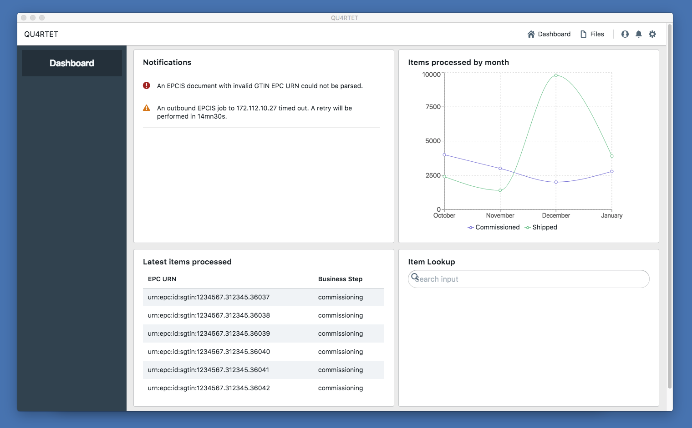

[](https://gitlab.com/serial-lab/quartet-ui/commits/master)

# QUARTET-UI Project

This project uses React, Redux, Electron, and Blueprint for UI.

Run `npm install` and `npm start` to get started and spawn the Electron app (with React bootstrapped inside Electron.)
You can also use `yarn install` and `yarn start`.
This will spawn an Electron window, as well as the React app in Google Chrome browser on port 3000 by default.

To run tests, `npm test` from the root directory should trigger all test suites.

## Screenshot



## Cohesive Component Structure for Reusability

There are three types of structural React components in QUARTET-UI:

* Layout components
* Screen components
* Card components

In the directory structure of this project, they are organized as follows:

```
src/components/
       └───layouts
       └───screens
       └───cards
```

These are meant to keep the layout and visual identity consistent across views and plugins.

### Layout components

Layout components are meant to define an arrangement to one or more screen components and provide a consistent
style to the broadest elements of the app. They are located in src/components/layouts.
There is currently only one layout component, called Panels.
It divides the main container (not including the header) into a left panel and a right panel.
The left panel is meant to provide a menu for the specific screen currently mounted.
The right panel is where the components for the main functionality for the screen are displayed.

#### Panels Layout

A Panels component can be used as followed, by passing left and right panels jsx as props along with a title:

    import {Panels} from "./components/layouts/panels";

    const screenMenu = props => <MyMenu>;
    const contents = props => <div>content goes here...</div>;

    export default props => {
        return (<Panels
            title="My New Screen"
            leftPanel={screenMenu()}
            rightPanel={contents()} />);
    };

Alternatively, if passing react elements as props isn't something you like, you can pass children in a nested way, for the same result:

    import {LeftPanel, RightPanel, Panels} from "./components/layouts/panels";
    export default props => {
        return (<Panels title="My New Screen">
          <LeftPanel><p>My Left Side</p></LeftPanel>
          <RightPanel><p>My right side</p></RightPanel>
        </Panels>);
    }

### Screen components

Screen components are components mounted based on a route (e.g.: /my-plugin)
They should use a common layout component to arrange their content.
The Panels example in the Layout components section is an example of a screen component divided into two panels.

### Card components

Card components are smaller pieces meant to provide a single distinct functionality to one or more screens.
They can be reused across the application where necessary.
Check src/components/cards/dashboard/NotificationsDisplay.js for a meaningful example of a card components providing notifications to the user.
It's used as part of the right panel in the Dashboard screen, located in src/components/screens/Dashboard.js

## Data Flow and State Management

QUARTET-UI uses Redux and React-Redux as its state container. This means most components do not need to manage their own state and re-rendering
of the components is based on updates from the store.
QUARTET-UI has a single store, located in src/store.js, as well as src/actions and src/reducers directories where Redux actions and reducers are located.
