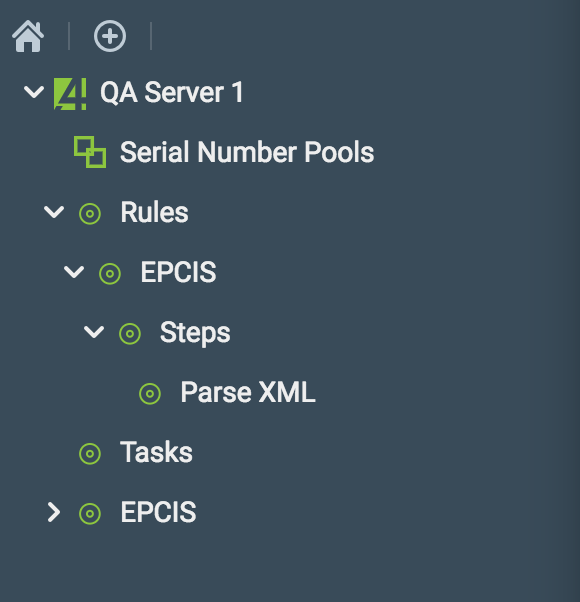

# Capture Plugin

## Overview

The capture plugin allows you to interact with QU4RTET Capture, enabling the capture and subsequent processing of messages through a highly customizable processing engine.
From the user interface, you can create/edit rules, steps, and their parameters and upload files as inbound messages for processing. Rules contain one or more steps with a reference to a Python class which will execute its code against the message.
Capture comes with a built-in common rule/step pair for EPCIS message processing and writing events/entries to the database persistently. This rule being the most common usage scenario of the Capture plugin, we detail below how to use it.

From the user interface, you will see two top nodes in the left navigation tree when Capture is enabled on a QU4RTET server, the "Rules" and "Tasks" nodes:

The Rules node lists all of the rules currently available on the system, and you can dive into the steps that compose each of them.
The Tasks node, on the other hand, lists all the tasks that have been created and their status. It also provides functionality to upload a file for processing according to one of the rules available.

### Parse XML Rule

The EPCIS Rule enables you to provide the system an inbound EPCIS XML-formatted file and write it to the file system. It is comprised of only one step by default, the Parse XML step. As you can see below, the Parse XML step executes the `quartet_epcis.parsing.steps.EPCISParsingStep` class, which parses and writes events and entries into the database through the QU4RTET EPCIS package.

The Execution Order is an important part in the execution of steps within a rule, since it determines the sequential order in which the steps are executed.

### Uploading an EPCIS Message for Processing

To process a file with a rule, right click on the `Tasks` node in the navigation tree, then click on "Create a New Task" in the context menu:

A dialog box opens to select a rule and provide a file for upload:

The Rule dropdown will list all the rules available on the system, in this case, we only have the default "EPCIS" rule created:

The second field is to select a file for upload. The file should comply with the steps and its execution classes for the task to be successful. Given we selected the EPCIS rule, we select a file containing a valid EPCIS XML message:

Shortly after selecting the file, a new task is listed on the Tasks List screen.
You will see all tasks that are created on the server, rather than just the own tasks you created. Tasks may be queued, running, finished, or failed. The tasks list is refreshed every 5 seconds and shows the most recently changed tasks at the top:

In this instance, the task was processed as soon as it was uploaded, with a final `finished` status.

As the usage of the system and rules grow, the tasks list will be updated with more tasks:

