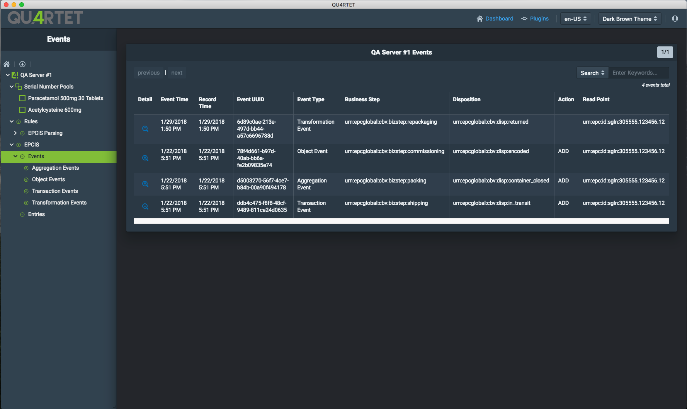
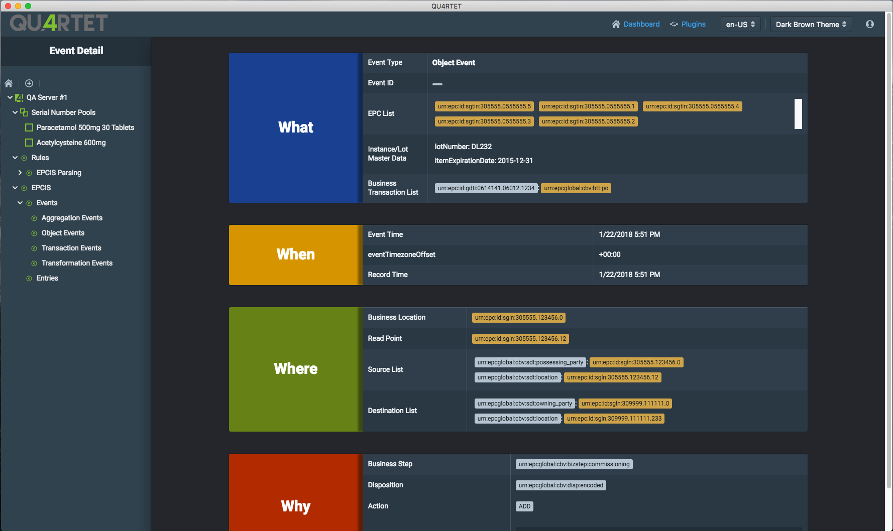

# EPCIS Plugin

## Overview

The EPCIS plugin lists events, entries and all data related to them.

### Events List

To see the list of events that have been recorded on a given system, expand the EPCIS node under the server of your choice, then click on the `Events` node.

You can also narrow down the events returned by clicking on the event types nodes under the Events node. There are four types of event filters available:

* Aggregation Events
* Object Events
* Transaction Events
* Transformation Events

### Event Detail

From any of the event list screens, clicking on an event row will take you to the event detail screen, where you can find fields and attributes for the event selected:

Event data is divided into four groups:

* What: Detail on what the event is, what are the entries related to it, Instance/lot master data, and transaction data.

* When: When this event occurred

* Where: All the geo-location data related to this event (SGLN, ...)

* Why: Details on the reason why this event occurred, and errors, if applicable.
