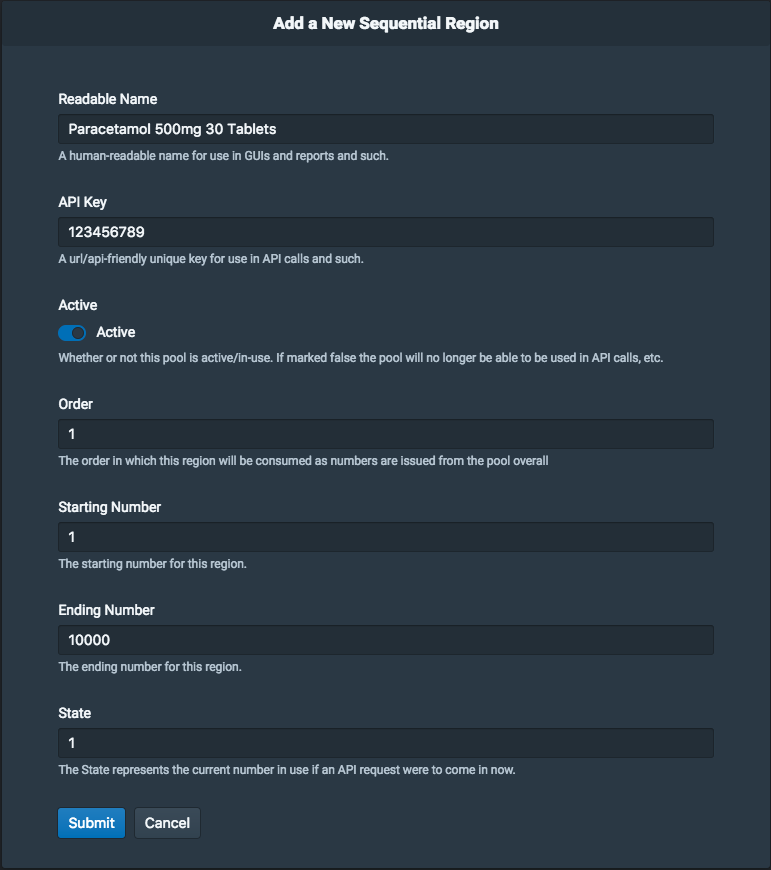
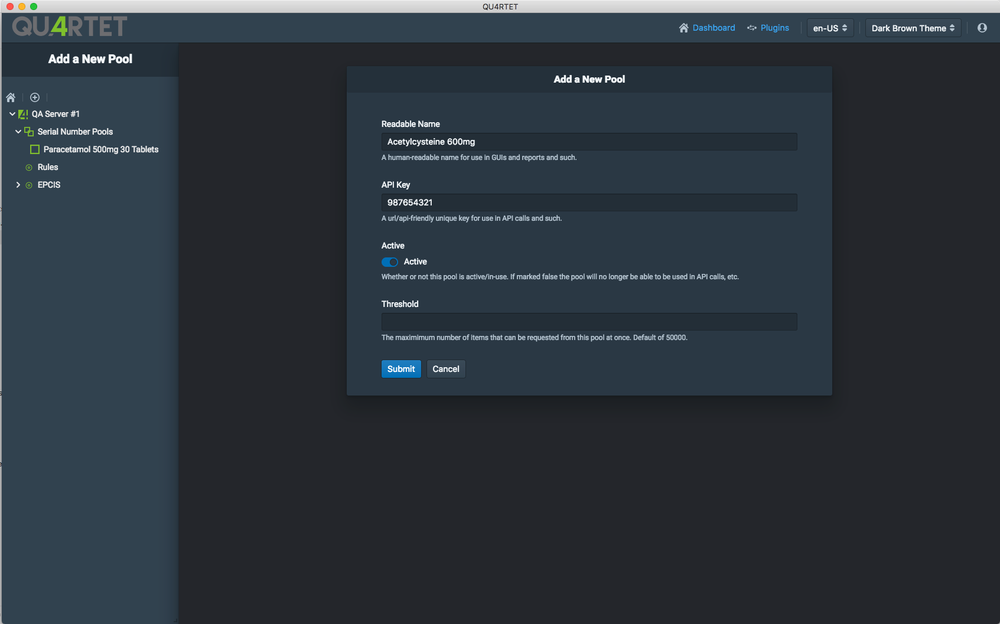
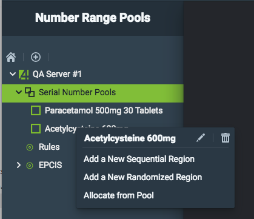
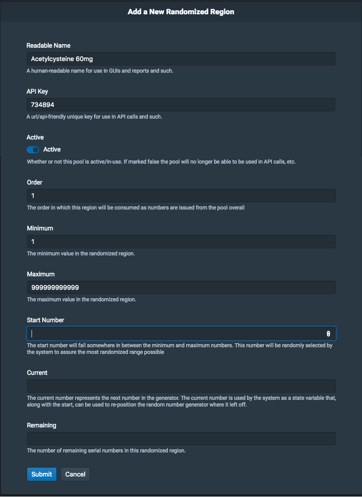
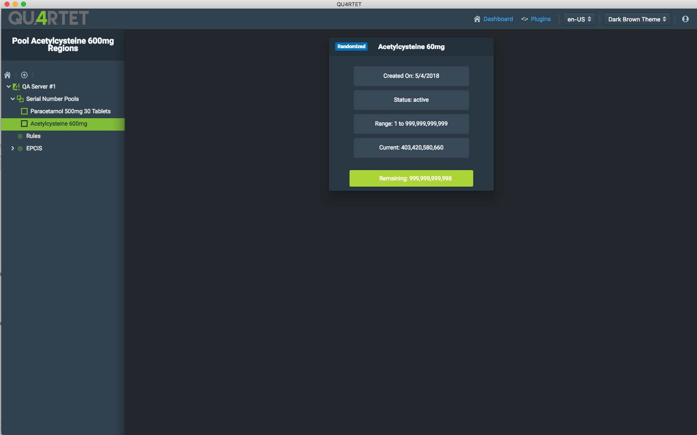
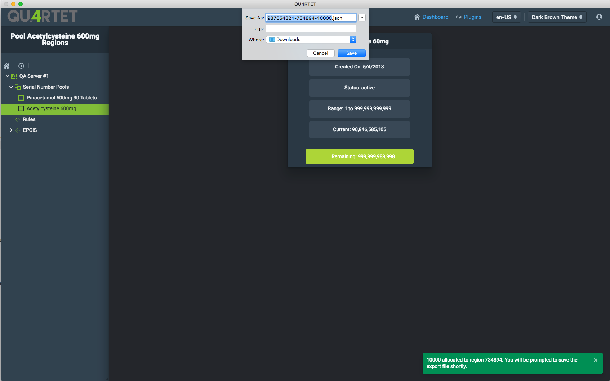

# Number Range Plugin

## Overview

The Number Range plugin allows you to interact with the SerialBox QU4RTET server module. For more information on SerialBox concepts, please see the [SerialBox documentation](https://serial-lab.gitlab.io/serialbox/index.html).

## Creating a Pool

For more information on basic number range management concepts in QU4RTET please see the [SerialBox Getting Started page](https://serial-lab.gitlab.io/serialbox/basic_concepts/index.html).

To create a pool on a given server with SerialBox enabled, click on a server node in the navigation tree and right-click on the "Serial Number Range" menu item:

Finally, click on "Add a New Pool" to get into the pool creation form.

### Filling the Pool Form

Three fields are required and one is optional to create a pool.

* ReadableName: A humain-readable name for use in the QU4RTET Desktop App, reports, ...
* API Key: A URL/API-friendly unique key for use in API calls.
* Active: Whether or not this pool is in use. A pool that is not active cannot be used in API calls such as number allocation.
* Threshold: An optional field, the maximum number of items that can be requested from this pool at once. The default if left blank is 50000.

After filling the form, click Submit.

You will then see your new pool appear on the Number Range listing screen:

## Creating a new Region

Out of the box, you may create two types of regions:

* Sequential Regions
* Randomized Regions

A pool cannot mix its region types once a first region has been created. For instance, if you decide to create a randomized region for a given pool, you will only be able to create additional randomized regions for this pool.

### Creating a Sequential Region

Sequential regions yield numbers in sequential order. To create a new sequential region, right-click on the Serial Number Pools node under your server tree.

Choose the "Add a New Sequential Region" item in the menu.

#### Filling the Sequential Region Form

Similarly to the Pool Creation form, the Sequential Region form requires a number of values:

* Readable Name: A human-readable name for use in the QU4RTET Desktop App, API descriptions, and reports generated by the QU4RTET backend.

* API Key: A URL/API-friendly unique key for use in API calls.

* Active: Whether or not this region is still in use and has remaining number to yield.

* Order: The order in which this region will be consumed as numbers are issued from the pool overall.

* Starting Number: The starting number for this region.

* Ending Number: The ending number for this region.

* State: The State represents the current number in use if an API request were to come in now.

Upon Submitting the form, a new region object will be represented on the Pool Detail screen. It contains the main information regarding the pool.

### Number Allocation on Sequential Regions

While number allocations typically happen via the REST API, the QU4RTET user interface also allows you to allocate numbers and generate an output in a number of file formats.
To start allocating from the pool, right click on the pool name in the navigation tree and click on "Allocate from Pool":

A pop up window will appear on top of the pool detail screen:

You can enter the quantity that you want to allocate, in this example, we choose to allocate 300 numbers. You can also select the Export Type. Currently supported are the JSON format, CSV (which can be opened with Microsoft Excel), and XML.

After clicking the Allocate from Pool, a toaster will appear on the bottom right of the screen to detail the success or failure of the operation, and a save prompt will allow you to keep the file locally on your system:

### Creating a Randomized Region

As mentioned earlier, a pool cannot hold both sequential and randomized regions. In order to demonstrate the process to create a randomized region, you can create a new pool by following the steps detailed above:

Once the new pool is created, right-click on the pool name in the navigation tree and select "Add a New Randomized Region":

The Randomized Region form appears and features a number of required fields as well as optional fields:

Many of the required fields are similar to the Sequential Region form:

* Readable Name: A human-readable name for use in the QU4RTET Desktop App, API descriptions, and reports generated by the QU4RTET backend.

* API Key: A URL/API-friendly unique key for use in API calls.

* Active: Whether or not this region is still in use and has remaining number to yield.

* Order: The order in which this region will be consumed as numbers are issued from the pool overall.

Two additional required fields are present; they define the range within which randomized numbers will be allocated:

* Minimum: The minimum value in the randomized region

* Maximum: The maximum value in the randomized region

Three additional fields are present and fully optional, they will be filled automatically after an allocation has been performed:

* Start Number: The start number will fall somewhere in between the minimum and maximum numbers. This number will be randomly selected by the system to assure the most randomized range possible.

* Current: The current number represents the next number in the generator. The current number is used by the system as a state variable that, along with the start, can be used to re-position the random number generator where it left off.

* Remaining: The number of remaining serial number in this randomized region.

After saving the form, a new randomized region card will appear on the Pool Detail screen:

By right-clicking the pool name and selecting, "Allocate from Pool, in the same process as the Sequential Region, you must enter a value representing the numbers to allocate and the format desired for the export:

A success/failure toast then appears on the bottom right of the screen, and a download prompt lets you save the file locally:

The file is automatically named using the following format `[pool api-key]-[region api-key]-[allocation-count].[file extension]`, but it can be renamed prior to saving the file locally. The maximum file size and computing time is determined by your local computer resources as well as the QU4RTET server resources available.
